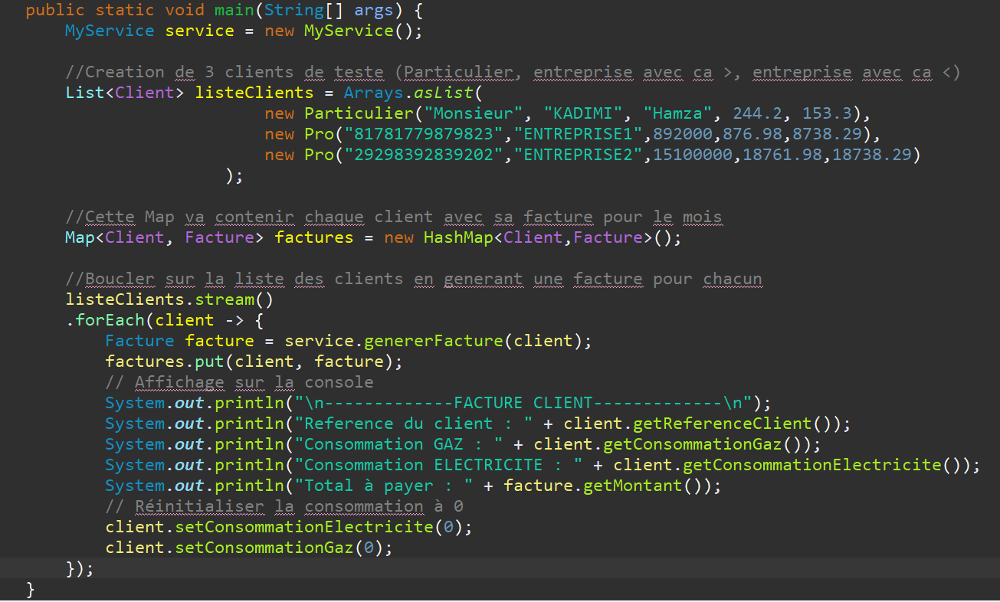
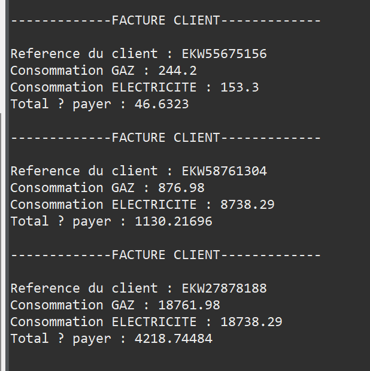

# Application de gestion des clients et des factures pour EKWATEUR

## Table of Contents

- [About](#about)
- [Fonctionnalités](#fonctionnalités)
- [Captures d'ecran](#captures)

## About 

Cette application Java 17 permet de gérer la création de clients, qu'ils soient particuliers ou professionnels. Chaque client possède sa propre consommation de gaz et d'électricité. À la fin de chaque mois, l'application génère les factures pour les clients et réinitialise les compteurs de consommation.

## Fonctionnalités 

Création de clients : L'application permet de créer des clients en spécifiant s'ils sont des particuliers ou des professionnels. Chaque client a une référence unique et un suivi de consommation de gaz et d'électricité.

Génération de factures : L'application génère les factures pour tous les clients. Les factures incluent les détails de consommation de chaque client, ainsi que le montant total à payer.

### Prerequisites

-Assurez-vous d'avoir Java 17 installé sur votre machine.

-Clonez le dépôt de l'application.
git clone https://github.com/KadimiHamza99/TechnicalTestEkwateur.git

-Ouvrez le projet dans votre environnement de développement Java préféré.

-Examinez le code source pour comprendre le fonctionnement de l'application. Les commentaires dans le code fournissent des explications détaillées.

-Exécutez l'application.

### Captures d'ecran 

-Code de test:

-Execution:

